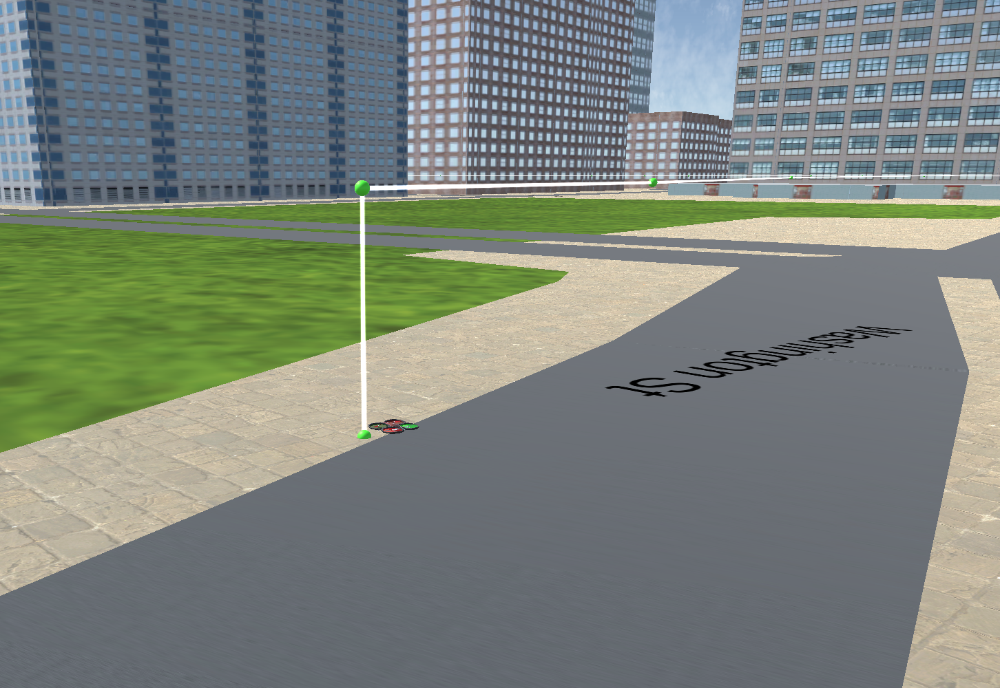
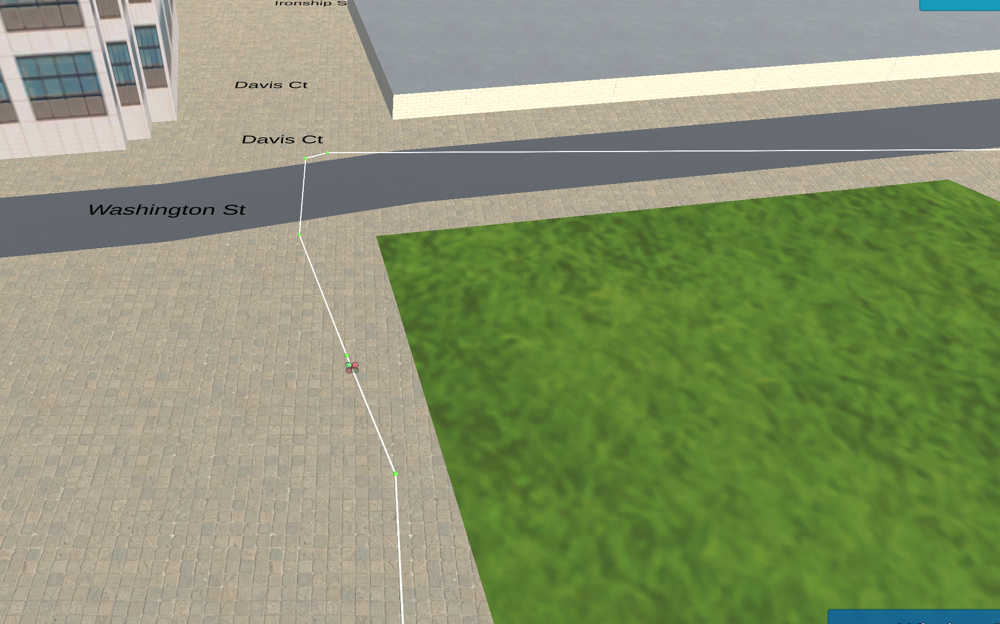
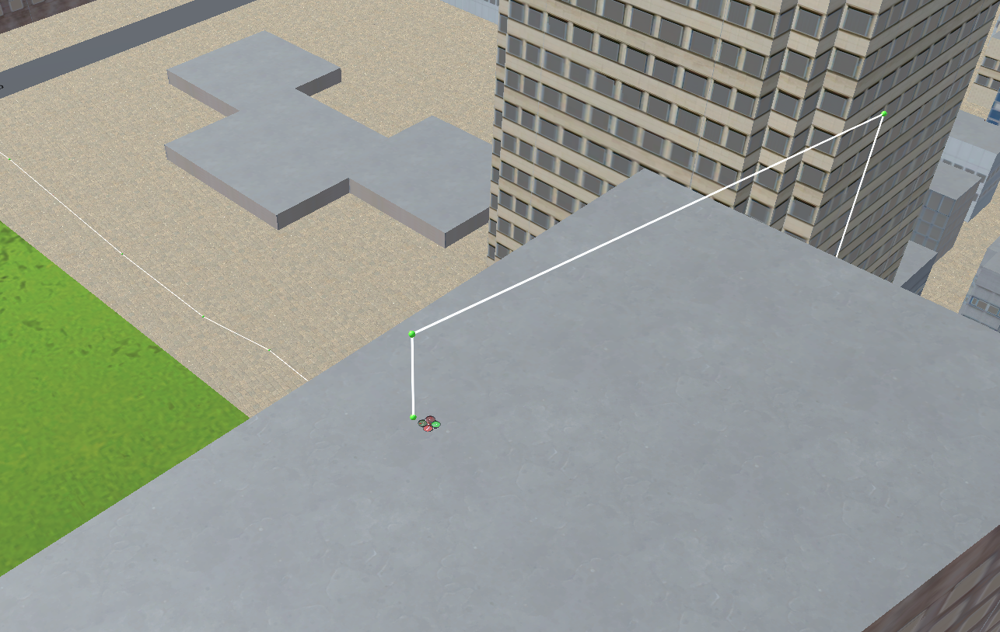
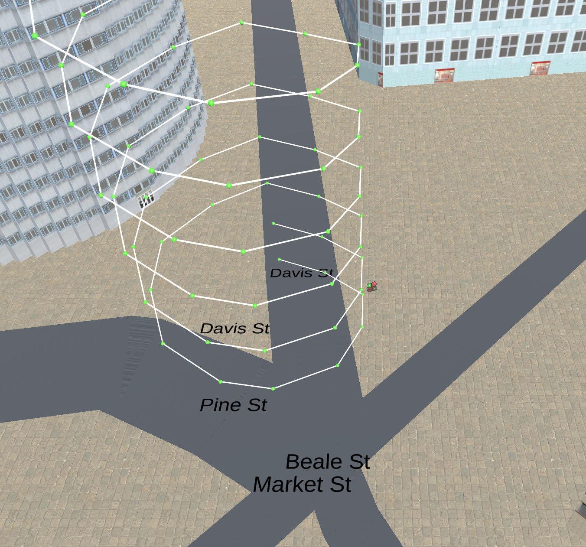

## Project: 3D Motion Planning


---
### Writeup / README

### Explain the Starter Code

#### 1. Explain the functionality of what's provided in `motion_planning.py` and `planning_utils.py`
Similar to `backyar_flyer_solution`, `Motion planning` contains event driven state transition logic and callback handlers. 

It connects to simulator through abstracted MAVLinkConnection layer.

Drone flyer will step through states enum one by one, motion planner will enter planning state right after arming successfully, `plan_route` Load the 2.5D map in the `colliders.csv` file describing the environment which contains obstacles locations.

State | Sequence
--- | --- |
MANUAL | 1 
ARMING | 2
PLANNING | 3
TAKEOFF | 4
WAYPOINT | 5
LANDING | 6
DISARMING | 7


### Implementing Your Path Planning Algorithm

`self.set_home_position` is used to set home position defined in the first line of CSV in (lat lon up, convention) 

```$xslt
lat0 37.792480, lon0 -122.397450
posX,posY,posZ,halfSizeX,halfSizeY,halfSizeZ
```

using util function `global_to_local` transform coordination to local north east down (NED convention)

```$xslt
local_pos = global_to_local(self.global_position, self.global_home)
```

grid_map is generated using `create_grid` which incorporated safety distance, this step not only create a representation of 
map geometry, it also reduced complexity of search space. 

```$xslt
grid_start = (int(-north_offset + local_pos[0]), int(-east_offset + local_pos[1]))

```


#### 4. Set grid goal position from geodetic coords


We could try different destinations with `--goal` argument

```$xslt
python motion_planning.py --goal="-122.396153, 37.797438, 0"
python motion_planning.py --goal="-122.397959, 37.797751, 68"
```
The default destination is --goal="-122.396153, 37.797438, 0"





#### 5. Modify A* to include diagonal motion (or replace A* altogether)


Include diagonal motions to action Enum

```
NW = (-1, -1, np.sqrt(2))
NE = (-1, 1, np.sqrt(2))
SW = (1, -1, np.sqrt(2))
SE = (1, 1, np.sqrt(2))
```

Checking valid diagonal moves in `valid_actions`

```$xslt
if x - 1 < 0 or y + 1 > m or grid[x - 1, y + 1] == 1:
    valid_actions.remove(Action.NE)
if x + 1 > n or y + 1 > m or grid[x + 1, y + 1] == 1:
    valid_actions.remove(Action.SE)
if x - 1 < 0 or y - 1 < 0 or grid[x - 1, y - 1] == 1:
    valid_actions.remove(Action.NW)
if x + 1 > n or y - 1 < 0 or grid[x + 1, y - 1] == 1:
    valid_actions.remove(Action.SW)

```

#### 6. Cull waypoints 

Bresenham algorithm is used to prune path which makes planning converging quickly. 

Paths generated by `A*` will be ran through `brensenham_path` for pruning. `check_collision` is used for collision checking, as the name hints. 

### Execute the flight

# Extra Challenges: 

### Planning in 3D

Taking off and landing on top of building.

Brute force implementation, putting all non-obstacle grid coordinates in a `KDTree`. 

When near starting and landing points, query KDTree for the nearest safe point. 




### Deadband

`DEADBAND` is set to 3

### Flying a double helix

Algorithm used for generating double helix waypoints could be found in `planning_utils` module `generate_helix`

by discretizing [helix mathematical descritpion](https://en.wikipedia.org/wiki/Helix) 

`
python motion_planning.py --helix=True
`



# Notes

This project is done in haste. Because we are relying on the stock `A*` implementation, it is pretty much a 2D planner. 

In the future, I would like to make it as a full 3D controller, then redo the project with real time probabilistic algorithms such as RRT or potential field method.

